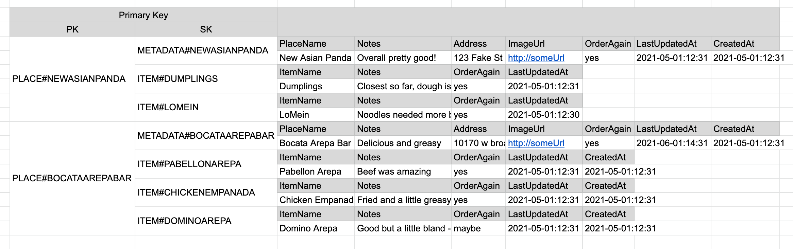

# Do I Like This?

Small app to help me and my wife keep track of things that we do and don't like.

## Why?

Could this be a google doc? yes.

Could this be a shared Notes app note? yes.

**Should** it be one of those? Probably yes, but here we are.

## Data structure:

Data is stored in a single Dynamo table for ease, speed, availability, and low price.

We're generally following the [Composite primary key + the Query API action](https://www.alexdebrie.com/posts/dynamodb-one-to-many/#composite-primary-key--the-query-api-action) pattern here.

We'll have two types of objects - the "Place" which is a parent container for "Item" objects.

This is small, so we're manually handling data operations. If it got more complex, we'd probably look into [@aws/dynamodb-data-mapper](https://github.com/awslabs/dynamodb-data-mapper-js).
